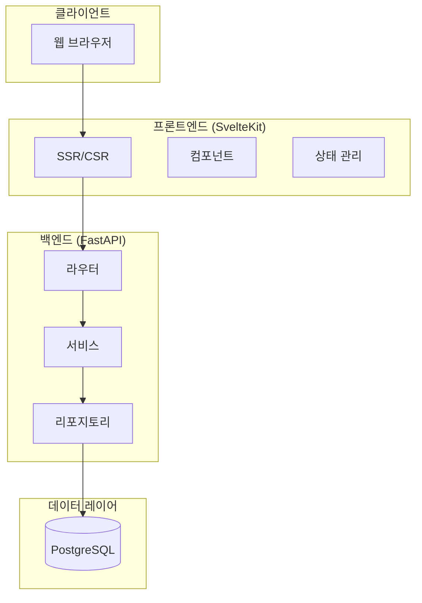
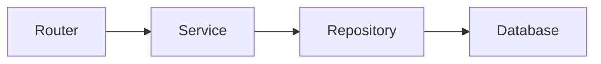
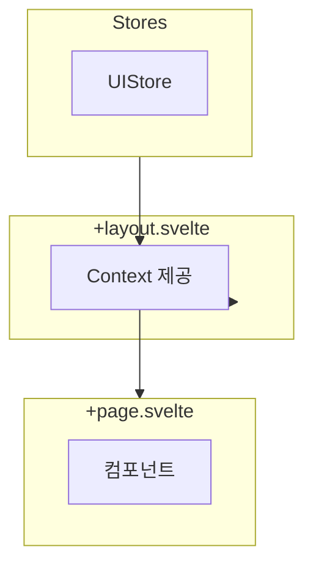

# 시스템 아키텍처

프로젝트의 전체 시스템 구조와 설계 원칙을 설명합니다.

## 아키텍처 개요



## 설계 원칙

### 1. 도메인 주도 설계 (DDD)

백엔드는 도메인별로 모듈화되어 있습니다:

```
app/
├── core/           # 공유 인프라
├── memos/          # 메모 도메인
├── health/         # 헬스체크
└── events/         # 이벤트 발행
```

각 도메인 모듈은 다음 구조를 따릅니다:

```
memos/
├── __init__.py
├── models.py       # 데이터베이스 모델
├── schemas.py      # Pydantic 스키마 (요청/응답)
├── repository.py   # 데이터 접근 계층
├── service.py      # 비즈니스 로직
├── router.py       # API 엔드포인트
└── dependencies.py # 의존성 주입
```

### 2. 레이어드 아키텍처



| 레이어 | 책임 | 예시 |
|--------|------|------|
| Router | HTTP 요청/응답 처리 | `@router.post("/memos/")` |
| Service | 비즈니스 로직 | 검증, 이벤트 발행 |
| Repository | 데이터 접근 | CRUD 쿼리 실행 |

### 3. 의존성 주입 (DI)

FastAPI의 `Depends()`를 사용하여 의존성을 주입합니다:

```python
# dependencies.py
async def get_memo_service(
    repository: AbstractMemoRepository = Depends(get_memo_repository),
    event_publisher: AbstractEventPublisher = Depends(get_event_publisher)
) -> MemoService:
    return MemoService(repository, event_publisher)

# router.py
@router.post("/memos/")
async def create_memo(
    memo: MemoCreate,
    service: MemoService = Depends(get_memo_service),
):
    return await service.create_memo(memo, memo.author)
```

### 4. 리포지토리 패턴

데이터베이스 구현을 추상화하여 테스트와 교체를 용이하게 합니다:

```python
# 추상 인터페이스
class AbstractMemoRepository(ABC):
    @abstractmethod
    async def get_by_id(self, id: int) -> Optional[dict]: ...

    @abstractmethod
    async def create(self, entity: dict) -> dict: ...

# 구현체
class MemoRepository(AbstractMemoRepository):
    def __init__(self, session: AsyncSession):
        self.session = session

    async def get_by_id(self, id: int) -> Optional[dict]:
        query = memos.select().where(memos.c.id == id)
        result = await self.session.execute(query)
        return dict(result.mappings().first()) if result else None
```

## 프론트엔드 아키텍처

### Svelte 5 패턴



## 이벤트 시스템

동아리 규모에서 메시지 큐는 불필요하여 이벤트 발행은 `NullEventPublisher`(no-op)로 처리됩니다. 향후 필요 시 실제 publisher 구현체로 교체할 수 있도록 인터페이스만 유지하고 있습니다.

## 보안 설정

| 항목 | 설정 |
|------|------|
| CORS | 명시적 origin 목록 |
| Rate Limiting | 엔드포인트별 제한 |
| CSP | Content-Security-Policy 헤더 |

## 다음 단계

- [백엔드 개발](./backend.md) - 상세 개발 가이드
- [프론트엔드 개발](./frontend.md) - UI 개발 가이드
- [인프라 설정](./infrastructure.md) - AWS 아키텍처
