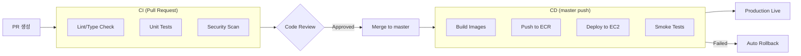
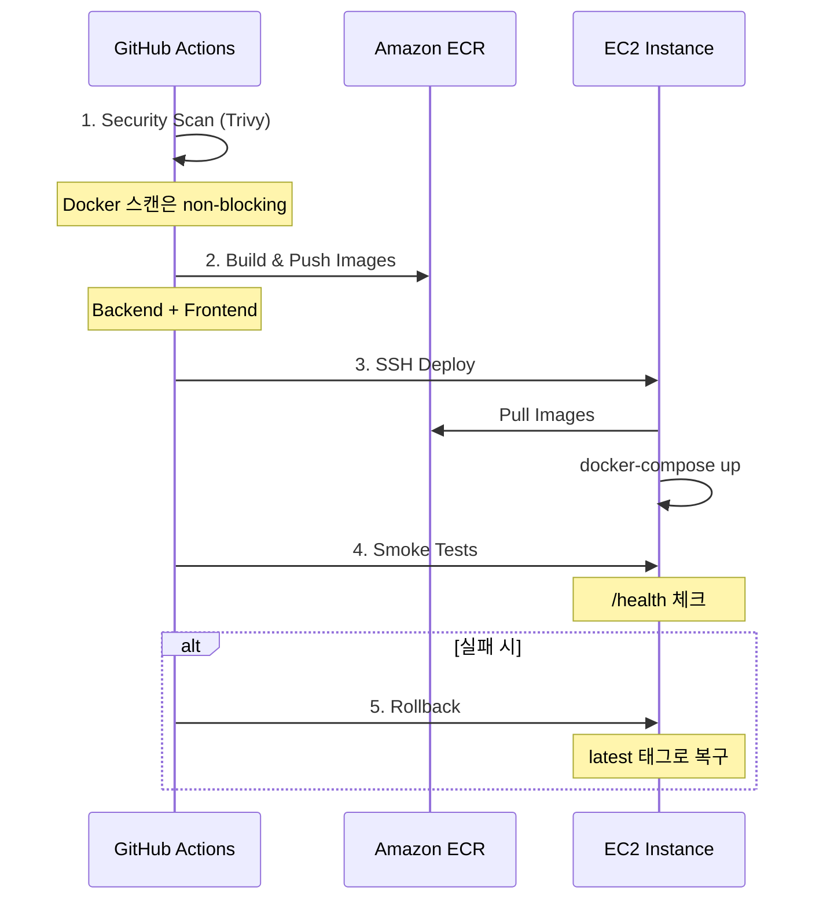

# 배포 가이드

GitHub Actions를 사용한 CI/CD 파이프라인과 프로덕션 배포 방법을 설명합니다.

## 배포 흐름



## CI 파이프라인

### Backend CI

Pull Request 시 자동 실행됩니다.

```yaml
# .github/workflows/backend-ci.yml
jobs:
  lint:     # Ruff 린트/포맷 검사
  test:     # pytest 단위 테스트
  security: # CodeQL 보안 분석
```

실행 조건:
- `app/**` 또는 `tests/**` 파일 변경 시
- Python 관련 설정 파일 변경 시

### Frontend CI

```yaml
# .github/workflows/frontend-ci.yml
jobs:
  lint:   # ESLint 검사
  check:  # TypeScript 타입 검사
  test:   # Vitest 단위 테스트
```

실행 조건:
- `frontend/**` 파일 변경 시

### 통합 테스트

```yaml
# .github/workflows/integration-tests.yml
jobs:
  integration:
    services:
      postgres: ...
    steps:
      - docker-compose up
      - API 엔드포인트 테스트
```

## CD 파이프라인

### 배포 트리거

1. **자동 배포**: `master` 브랜치 push
2. **태그 배포**: `v*.*.*` 태그 생성
3. **수동 배포**: GitHub Actions UI에서 실행

### 배포 단계



### GitHub Secrets 설정

Repository Settings > Secrets and variables > Actions:

```
AWS_ROLE_ARN         # OIDC 인증용 IAM Role ARN
ECR_BACKEND_REPO     # 예: sgcc-backend
ECR_FRONTEND_REPO    # 예: sgcc-frontend
EC2_HOST             # EC2 Public IP
EC2_USERNAME         # ec2-user
EC2_SSH_KEY          # SSH Private Key (PEM)
```

### OIDC 인증 설정

Access Key 대신 OIDC를 사용하면 더 안전합니다.

```hcl
# Terraform으로 OIDC Provider 생성
resource "aws_iam_openid_connect_provider" "github" {
  url             = "https://token.actions.githubusercontent.com"
  client_id_list  = ["sts.amazonaws.com"]
  thumbprint_list = ["6938fd4d98bab03faadb97b34396831e3780aea1"]
}

resource "aws_iam_role" "github_actions" {
  name = "github-actions-deploy"

  assume_role_policy = jsonencode({
    Version = "2012-10-17"
    Statement = [{
      Effect = "Allow"
      Principal = {
        Federated = aws_iam_openid_connect_provider.github.arn
      }
      Action = "sts:AssumeRoleWithWebIdentity"
      Condition = {
        StringEquals = {
          "token.actions.githubusercontent.com:aud" = "sts.amazonaws.com"
        }
        StringLike = {
          "token.actions.githubusercontent.com:sub" = "repo:Sogang-Computer-Club/sogangcomputerclub.org:*"
        }
      }
    }]
  })
}
```

## EC2 서버 설정

### 초기 설정

```bash
# EC2 접속
ssh -i ~/.ssh/sgcc-production.pem ec2-user@<EC2_IP>

# 필수 패키지 설치
sudo yum update -y
sudo yum install -y docker git

# Docker 시작
sudo systemctl start docker
sudo systemctl enable docker
sudo usermod -aG docker ec2-user

# Docker Compose 설치
sudo curl -L "https://github.com/docker/compose/releases/latest/download/docker-compose-$(uname -s)-$(uname -m)" -o /usr/local/bin/docker-compose
sudo chmod +x /usr/local/bin/docker-compose

# 애플리케이션 디렉토리
sudo mkdir -p /opt/sgcc
sudo chown ec2-user:ec2-user /opt/sgcc
```

### 배포 환경 파일

```bash
# /opt/sgcc/.deploy-env
export AWS_REGION=ap-northeast-2
export ECR_REGISTRY=123456789.dkr.ecr.ap-northeast-2.amazonaws.com
export PROJECT_NAME=sgcc
export SECRET_ARN=arn:aws:secretsmanager:ap-northeast-2:123456789:secret:sgcc/production
```

### 시크릿 가져오기 스크립트

```bash
#!/bin/bash
# /opt/sgcc/fetch-secrets.sh

SECRET_ARN=$1
REGION=$2
OUTPUT_FILE=$3

aws secretsmanager get-secret-value \
  --secret-id "$SECRET_ARN" \
  --region "$REGION" \
  --query SecretString \
  --output text | jq -r 'to_entries | .[] | "\(.key)=\(.value)"' > "$OUTPUT_FILE"
```

## 수동 배포

### 로컬에서 빌드 & 배포

```bash
# 1. ECR 로그인
aws ecr get-login-password --region ap-northeast-2 | \
  docker login --username AWS --password-stdin 123456789.dkr.ecr.ap-northeast-2.amazonaws.com

# 2. 이미지 빌드
docker build -t sgcc-backend .
docker build -t sgcc-frontend ./frontend

# 3. 태그 & 푸시
docker tag sgcc-backend:latest 123456789.dkr.ecr.ap-northeast-2.amazonaws.com/sgcc-backend:latest
docker push 123456789.dkr.ecr.ap-northeast-2.amazonaws.com/sgcc-backend:latest

# 4. EC2에서 배포
ssh ec2-user@<EC2_IP> "cd /opt/sgcc && docker-compose -f docker-compose.aws.yml pull && docker-compose -f docker-compose.aws.yml up -d"
```

### Rollback

```bash
# 이전 버전으로 롤백 (EC2에서)
cd /opt/sgcc
export IMAGE_TAG=<이전 커밋 SHA>
docker-compose -f docker-compose.aws.yml up -d --force-recreate
```

## 모니터링

### 헬스 체크

```bash
# Backend
curl https://sogangcomputerclub.org/api/v1/health

# 예상 응답
{
  "status": "healthy",
  "database": "connected"
}
```

### 로그 확인

```bash
# EC2에서
docker-compose -f docker-compose.aws.yml logs -f backend
docker-compose -f docker-compose.aws.yml logs -f frontend

# CloudWatch (AWS Console)
# Log Group: /ecs/sgcc-backend, /ecs/sgcc-frontend
```

### 메트릭

Prometheus + Grafana (docker-compose.yml):
- Prometheus: http://localhost:9090
- Grafana: http://localhost:3001

## 환경별 설정

### Production

```yaml
# docker-compose.aws.yml
services:
  backend:
    image: ${ECR_REGISTRY}/sgcc-backend:${IMAGE_TAG}
    logging:
      driver: awslogs
      options:
        awslogs-group: /ecs/sgcc-backend
        awslogs-region: ap-northeast-2
```

### Staging

```bash
# 별도 EC2 또는 같은 EC2의 다른 포트로 배포
docker-compose -f docker-compose.aws.yml -p sgcc-staging up -d
```

## 보안 체크리스트

- [ ] GitHub Secrets에 민감 정보 저장
- [ ] OIDC 인증 사용 (Access Key 대신)
- [ ] Trivy 보안 스캔 통과
- [ ] SSH 접근 IP 제한
- [ ] HTTPS 인증서 설정 (Let's Encrypt)
- [ ] RDS 비밀번호 Secrets Manager 저장

## 문제 해결

### 배포 실패 시

1. GitHub Actions 로그 확인
2. EC2 SSH 접속하여 로그 확인:
   ```bash
   docker-compose -f docker-compose.aws.yml logs backend
   ```
3. 자동 롤백 확인

### 이미지 Pull 실패

```bash
# ECR 로그인 갱신
aws ecr get-login-password --region ap-northeast-2 | \
  docker login --username AWS --password-stdin $ECR_REGISTRY
```

## 다음 단계

- [인프라 설정](./infrastructure.md) - AWS 리소스 상세
- [문제 해결](./troubleshooting.md) - 배포 문제 해결

