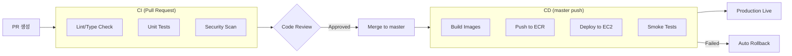
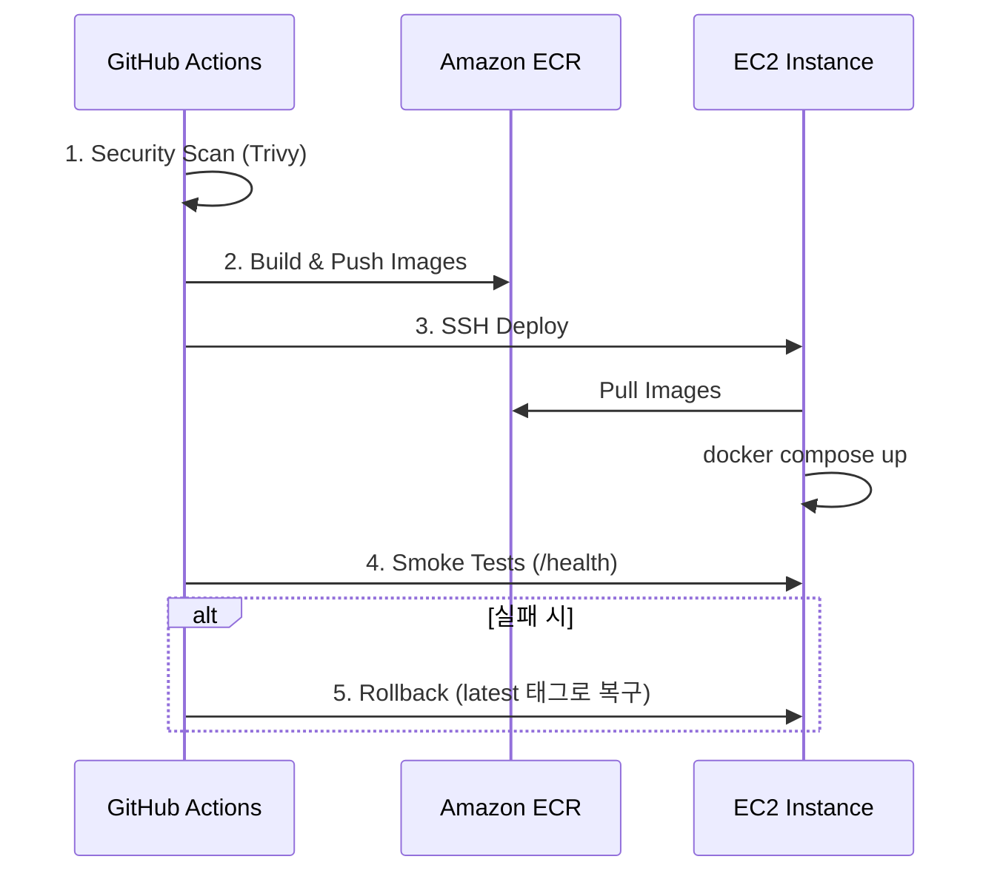

# 배포 가이드

GitHub Actions를 사용한 CI/CD 파이프라인과 프로덕션 배포 방법을 설명합니다.

## 배포 흐름

## CI 파이프라인

### Backend CI

Pull Request 시 `app/**`, `tests/**`, 또는 Python 설정 파일 변경이 감지되면 자동 실행됩니다. Ruff 린트/포맷 검사, pytest 단위 테스트, CodeQL 보안 분석의 세 가지 작업으로 구성됩니다. See `.github/workflows/backend-ci.yml`.

### Frontend CI

`frontend/**` 파일 변경 시 자동 실행됩니다. ESLint 검사, TypeScript 타입 검사, Vitest 단위 테스트를 수행합니다. See `.github/workflows/frontend-ci.yml`.

### 통합 테스트

PostgreSQL 서비스 컨테이너를 띄운 뒤 `docker compose -f deploy/docker-compose.yml up`으로 전체 스택을 실행하고 API 엔드포인트를 테스트합니다. See `.github/workflows/integration-tests.yml`.

## CD 파이프라인

### 배포 트리거

| 트리거 | 조건 |
|--------|------|
| 자동 배포 | `master` 브랜치 push |
| 태그 배포 | `v*.*.*` 태그 생성 |
| 수동 배포 | GitHub Actions UI에서 실행 |

### 배포 단계

### GitHub Secrets 설정

Repository Settings > Secrets and variables > Actions에서 아래 항목을 등록합니다.

| Secret | 설명 |
|--------|------|
| `AWS_ROLE_ARN` | OIDC 인증용 IAM Role ARN |
| `ECR_BACKEND_REPO` | 예: `sgcc-backend` |
| `ECR_FRONTEND_REPO` | 예: `sgcc-frontend` |
| `EC2_HOST` | EC2 Public IP |
| `EC2_USERNAME` | `ec2-user` |
| `EC2_SSH_KEY` | SSH Private Key (PEM) |

### OIDC 인증 설정

Access Key 대신 OIDC를 사용하면 더 안전합니다. Terraform으로 `aws_iam_openid_connect_provider`와 `aws_iam_role` 리소스를 생성하여 GitHub Actions가 `sts:AssumeRoleWithWebIdentity`로 인증하도록 구성합니다. Condition에서 audience를 `sts.amazonaws.com`으로, subject를 `repo:Sogang-Computer-Club/sogangcomputerclub.org:*`로 제한합니다. See `infrastructure/` 디렉토리의 Terraform 설정.

## EC2 서버 설정

### 초기 설정

EC2에 SSH 접속한 뒤 (`ssh -i ~/.ssh/sgcc-production.pem ec2-user@<EC2_IP>`) 다음 순서로 설정합니다.

1. `sudo yum update -y`로 패키지 업데이트
2. `sudo yum install -y docker git`으로 Docker, Git 설치
3. `sudo systemctl start docker && sudo systemctl enable docker`로 Docker 데몬 시작 및 자동 시작 등록
4. `sudo usermod -aG docker ec2-user`로 Docker 그룹에 사용자 추가
5. Docker Compose를 `/usr/local/bin/docker-compose`에 설치 (GitHub releases에서 최신 버전 다운로드)
6. `sudo mkdir -p /opt/sgcc && sudo chown ec2-user:ec2-user /opt/sgcc`로 애플리케이션 디렉토리 생성

### 배포 환경 파일

`/opt/sgcc/.deploy-env`에 아래 환경변수를 설정합니다.

| 변수 | 예시 값 |
|------|---------|
| `AWS_REGION` | `ap-northeast-2` |
| `ECR_REGISTRY` | `123456789.dkr.ecr.ap-northeast-2.amazonaws.com` |
| `PROJECT_NAME` | `sgcc` |
| `SECRET_ARN` | `arn:aws:secretsmanager:ap-northeast-2:123456789:secret:sgcc/production` |

### 시크릿 가져오기

`/opt/sgcc/fetch-secrets.sh` 스크립트가 AWS Secrets Manager에서 시크릿을 가져와 환경 파일로 변환합니다. `aws secretsmanager get-secret-value`로 JSON을 조회한 뒤 `jq`로 `KEY=VALUE` 형식으로 변환하여 지정된 출력 파일에 저장합니다. 사용법: `./fetch-secrets.sh <SECRET_ARN> <REGION> <OUTPUT_FILE>`

## 수동 배포

### 로컬에서 빌드 및 배포

1. `aws ecr get-login-password --region ap-northeast-2 | docker login --username AWS --password-stdin <ECR_REGISTRY>`로 ECR 로그인
2. `docker build -t sgcc-backend .`와 `docker build -t sgcc-frontend ./frontend`로 이미지 빌드
3. `docker tag`로 ECR 레지스트리 경로를 지정한 뒤 `docker push`로 업로드
4. EC2에 SSH 접속하여 `docker compose -f deploy/docker-compose.aws.yml pull && docker compose -f deploy/docker-compose.aws.yml up -d` 실행

### Rollback

EC2에서 `IMAGE_TAG` 환경변수를 이전 커밋 SHA로 설정한 뒤 `docker compose -f deploy/docker-compose.aws.yml up -d --force-recreate`를 실행합니다.

## 모니터링

### 헬스 체크

`curl https://sogangcomputerclub.org/api/v1/health`로 확인합니다. 정상 응답은 `status: healthy`, `database: connected`를 포함합니다.

### 로그 확인

- EC2에서: `docker compose -f deploy/docker-compose.aws.yml logs -f backend` (또는 `frontend`)
- AWS Console에서: CloudWatch Log Group `/ecs/sgcc-backend`, `/ecs/sgcc-frontend`

### 메트릭

로컬 환경에서 `deploy/docker-compose.yml`의 monitoring 프로필로 Prometheus (http://localhost:9090)와 Grafana (http://localhost:3001)를 사용할 수 있습니다.

## 환경별 설정

### Production

`deploy/docker-compose.aws.yml`에서 ECR 이미지를 `${ECR_REGISTRY}/sgcc-backend:${IMAGE_TAG}` 형식으로 참조하며, awslogs 드라이버로 CloudWatch에 로그를 전송합니다.

### Staging

동일한 EC2에서 별도 프로젝트 이름으로 실행합니다: `docker compose -f deploy/docker-compose.aws.yml -p sgcc-staging up -d`

## 보안 체크리스트

- [ ] GitHub Secrets에 민감 정보 저장
- [ ] OIDC 인증 사용 (Access Key 대신)
- [ ] Trivy 보안 스캔 통과
- [ ] SSH 접근 IP 제한
- [ ] HTTPS 인증서 설정 (Let's Encrypt)
- [ ] RDS 비밀번호 Secrets Manager 저장

## 문제 해결

### 배포 실패 시

1. GitHub Actions 로그 확인
2. EC2에 SSH 접속하여 `docker compose -f deploy/docker-compose.aws.yml logs backend`로 로그 확인
3. 자동 롤백 확인

### 이미지 Pull 실패

ECR 로그인 토큰이 만료되었을 수 있습니다. `aws ecr get-login-password --region ap-northeast-2 | docker login --username AWS --password-stdin $ECR_REGISTRY`로 갱신합니다.

## 다음 단계

- [인프라 설정](./infrastructure.md) - AWS 리소스 상세
- [문제 해결](./troubleshooting.md) - 배포 문제 해결
