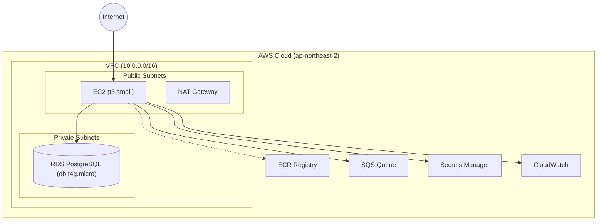
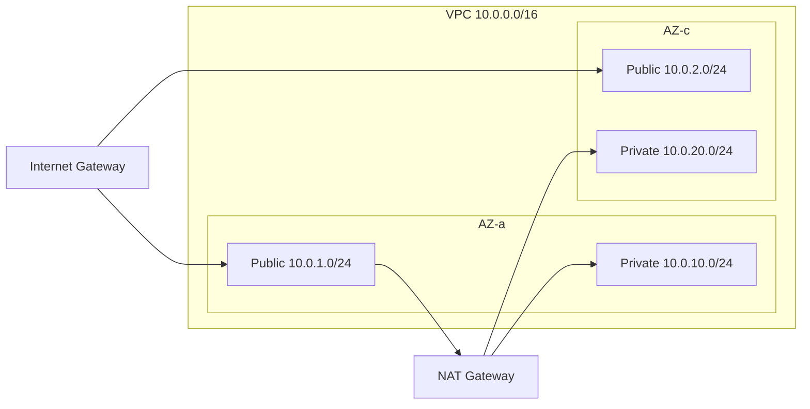

# 인프라 설정

Terraform을 사용한 AWS 인프라 구성을 설명합니다.

## 아키텍처 개요



## 예상 비용

| 리소스 | 사양 | 월 비용 |
|--------|------|---------|
| EC2 | t3.small (2vCPU, 2GB) | ~$15 |
| RDS | db.t4g.micro (2vCPU, 1GB) | ~$13 |
| EBS | gp3 30GB | ~$3 |
| NAT Gateway | 시간 + 데이터 | ~$5-10 |
| **합계** | | **~$35-40/월** |

> **Note**: 동아리 규모에서 불필요한 항목은 제외됨:
> - RDS Multi-AZ (+$13/월) - 고가용성 불필요
> - SQS (+$5/월) - 이벤트 시스템 비활성화 (EVENT_BACKEND=null)

## 프로젝트 구조

```
infrastructure/
├── main.tf              # 프로바이더, 백엔드 설정
├── variables.tf         # 변수 정의
├── outputs.tf           # 출력값
├── vpc.tf               # VPC, 서브넷, 라우팅
├── security_groups.tf   # 보안 그룹
├── ec2.tf               # EC2 인스턴스, IAM
├── rds.tf               # RDS PostgreSQL
├── sqs.tf               # SQS 대기열
├── ecr.tf               # ECR 레지스트리
├── secrets.tf           # Secrets Manager
└── cloudwatch.tf        # CloudWatch 로그, 알람
```

## 사전 요구사항

### 1. AWS CLI 설정

```bash
# AWS CLI 설치
brew install awscli  # macOS

# 자격 증명 설정
aws configure
# AWS Access Key ID: [입력]
# AWS Secret Access Key: [입력]
# Default region name: ap-northeast-2
# Default output format: json
```

### 2. Terraform 설치

```bash
# macOS
brew install terraform

# 버전 확인
terraform version  # >= 1.0
```

### 3. SSH 키 생성

```bash
# EC2 접근용 키 생성
aws ec2 create-key-pair \
  --key-name sgcc-production \
  --query 'KeyMaterial' \
  --output text > ~/.ssh/sgcc-production.pem

chmod 400 ~/.ssh/sgcc-production.pem
```

## 배포 방법

### 1. 변수 설정

```bash
cd infrastructure

# terraform.tfvars 생성
cat > terraform.tfvars << 'EOF'
aws_region        = "ap-northeast-2"
environment       = "production"
project_name      = "sgcc"

# EC2
ec2_instance_type = "t3.small"
ec2_key_name      = "sgcc-production"
ec2_volume_size   = 30

# RDS
db_instance_class = "db.t4g.micro"
db_name           = "sgcc_db"
db_username       = "sgcc_admin"
db_password       = "your-secure-password-here"  # 반드시 변경
db_multi_az       = false  # 동아리 규모에서 불필요 (비용 절감)

# SSH 접근 (본인 IP만 허용)
# curl ifconfig.me 로 확인
allowed_ssh_cidrs = ["1.2.3.4/32"]
EOF
```

### 2. 인프라 생성

```bash
# 초기화
terraform init

# 계획 확인
terraform plan

# 적용
terraform apply

# 출력값 확인
terraform output
```

### 3. 상태 확인

```bash
# EC2 접속
ssh -i ~/.ssh/sgcc-production.pem ec2-user@$(terraform output -raw ec2_public_ip)

# RDS 연결 테스트 (EC2 내에서)
psql -h $(terraform output -raw rds_endpoint) -U sgcc_admin -d sgcc_db
```

## 리소스 상세

### VPC 네트워크



- **Public Subnets**: EC2, NAT Gateway (인터넷 접근 가능)
- **Private Subnets**: RDS (인터넷 직접 접근 불가)

### Security Groups

| 그룹 | 인바운드 | 용도 |
|------|----------|------|
| EC2 | 80/443 (전체), 22 (지정 IP) | 웹 트래픽, SSH |
| RDS | 5432 (EC2 SG만) | 데이터베이스 |
| Internal | 전체 (VPC 내부) | 서비스 간 통신 |

### EC2 인스턴스

```hcl
# IAM 권한 (최소 권한 원칙)
- ECR: 이미지 Pull
- SQS: 메시지 송수신
- Secrets Manager: 시크릿 조회
- CloudWatch: 로그 전송
```

### 관리자 IAM 그룹

동아리 관리자(인수인계 대상)를 위한 IAM 그룹:

```bash
# 그룹에 포함된 정책
- AmazonEC2FullAccess
- AmazonRDSFullAccess
- AmazonEC2ContainerRegistryFullAccess
- AmazonSQSFullAccess
- SecretsManagerReadWrite
- CloudWatchFullAccess
- AmazonVPCFullAccess
- IAMReadOnlyAccess
```

**사용법:**
1. AWS Console → IAM → Users → Create user
2. 사용자 생성 후 `sgcc-admins` 그룹에 추가
3. Access Key 발급 (CLI 사용 시)

### RDS PostgreSQL

- **엔진**: PostgreSQL 15
- **Multi-AZ**: 기본 비활성화 (동아리 규모에서 불필요, 비용 2배)
- **백업**: 1일 자동 백업 (Free Tier 제한)
- **암호화**: AES-256 (저장 데이터)
- **접근**: VPC 내부에서만 (Private Subnet)

### SQS 대기열 (선택적)

> **Note**: 이벤트 시스템은 기본 비활성화됨 (`EVENT_BACKEND=null`).
> 동아리 규모에서 이벤트 큐는 불필요합니다.

`EVENT_BACKEND=sqs` 설정 시 사용:

```
이벤트 큐 구성:
- 메인 큐: sgcc-events
- DLQ (Dead Letter Queue): sgcc-events-dlq
- 재시도: 3회 실패 시 DLQ 이동
- 보존: 4일 (DLQ: 14일)
```

## 팀 협업 (S3 Backend)

여러 개발자가 Terraform을 사용할 경우 상태 파일 공유가 필요합니다.

### 1. S3 버킷 생성

```bash
# 상태 저장용 S3
aws s3 mb s3://sgcc-terraform-state --region ap-northeast-2

# 버전 관리 활성화
aws s3api put-bucket-versioning \
  --bucket sgcc-terraform-state \
  --versioning-configuration Status=Enabled

# 암호화 활성화
aws s3api put-bucket-encryption \
  --bucket sgcc-terraform-state \
  --server-side-encryption-configuration '{
    "Rules": [{"ApplyServerSideEncryptionByDefault": {"SSEAlgorithm": "AES256"}}]
  }'
```

### 2. DynamoDB 락 테이블

```bash
aws dynamodb create-table \
  --table-name sgcc-terraform-locks \
  --attribute-definitions AttributeName=LockID,AttributeType=S \
  --key-schema AttributeName=LockID,KeyType=HASH \
  --billing-mode PAY_PER_REQUEST \
  --region ap-northeast-2
```

### 3. Backend 설정 활성화

`main.tf`의 backend 블록 주석 해제:

```hcl
backend "s3" {
  bucket         = "sgcc-terraform-state"
  key            = "production/terraform.tfstate"
  region         = "ap-northeast-2"
  encrypt        = true
  dynamodb_table = "sgcc-terraform-locks"
}
```

```bash
# 백엔드 마이그레이션
terraform init -migrate-state
```

## 비용 최적화

### 개발/스테이징 환경

```hcl
# terraform.tfvars (개발용)
ec2_instance_type = "t3.micro"   # ~$8/월
db_instance_class = "db.t4g.micro"
db_multi_az       = false        # 단일 AZ (비용 절감)
```

### Reserved Instances

프로덕션에서 1년 이상 운영 시:
- EC2 RI: 최대 40% 절감
- RDS RI: 최대 30% 절감

## 정리 (삭제)

```bash
# 모든 리소스 삭제
terraform destroy

# 확인 후 'yes' 입력
```

⚠️ **주의**: RDS 삭제 시 데이터가 영구 삭제됩니다. 필요한 경우 스냅샷을 먼저 생성하세요.

## 다음 단계

- [배포 가이드](./deployment.md) - CI/CD 파이프라인
- [문제 해결](./troubleshooting.md) - 인프라 문제 해결

