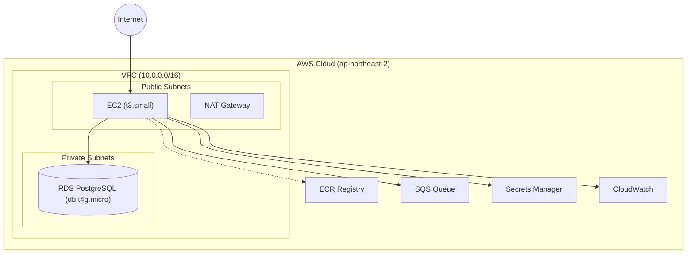
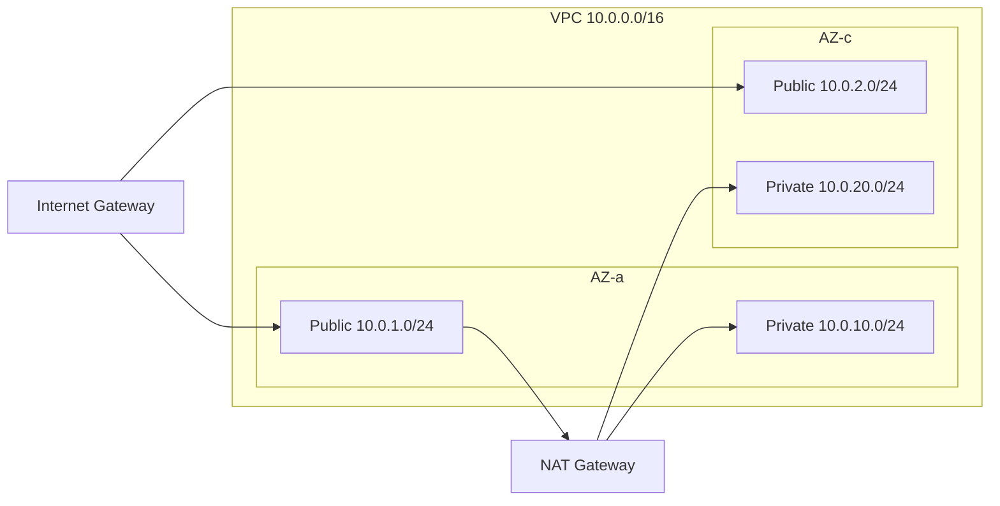

# 인프라 설정

Terraform을 사용한 AWS 인프라 구성을 설명합니다.

## 아키텍처 개요

## 예상 비용

| 리소스 | 사양 | 월 비용 |
|--------|------|---------|
| EC2 | t3.small (2vCPU, 2GB) | ~$15 |
| RDS | db.t4g.micro (2vCPU, 1GB) | ~$13 |
| EBS | gp3 30GB | ~$3 |
| NAT Gateway | 시간 + 데이터 | ~$5-10 |
| **합계** | | **~$35-40/월** |

> **Note**: 동아리 규모에서 불필요한 항목은 제외됨:
> - RDS Multi-AZ (+$13/월) - 고가용성 불필요
> - SQS (+$5/월) - 이벤트 시스템 비활성화 (EVENT_BACKEND=null)

## 프로젝트 구조

| 파일 | 역할 |
|------|------|
| `main.tf` | 프로바이더, 백엔드 설정 |
| `variables.tf` | 변수 정의 |
| `outputs.tf` | 출력값 |
| `vpc.tf` | VPC, 서브넷, 라우팅 |
| `security_groups.tf` | 보안 그룹 |
| `ec2.tf` | EC2 인스턴스, IAM |
| `rds.tf` | RDS PostgreSQL |
| `sqs.tf` | SQS 대기열 |
| `ecr.tf` | ECR 레지스트리 |
| `secrets.tf` | Secrets Manager |
| `cloudwatch.tf` | CloudWatch 로그, 알람 |

모든 파일은 `infrastructure/` 디렉토리에 위치합니다.

## 사전 요구사항

### 1. AWS CLI 설정

macOS에서 `brew install awscli`로 설치한 뒤 `aws configure`를 실행하여 자격 증명을 설정합니다. 리전은 `ap-northeast-2`, 출력 형식은 `json`을 사용합니다.

### 2. Terraform 설치

macOS에서 `brew install terraform`으로 설치합니다. 버전 1.0 이상이 필요합니다.

### 3. SSH 키 생성

`aws ec2 create-key-pair` 명령으로 `sgcc-production` 이름의 키 페어를 생성하고 `~/.ssh/sgcc-production.pem`에 저장합니다. 파일 권한은 400으로 설정합니다.

## 배포 방법

### 1. 변수 설정

`infrastructure/terraform.tfvars` 파일을 생성합니다. 기본 설정값은 아래 표를 참고하세요.

| 변수 | 값 | 비고 |
|------|------|------|
| `aws_region` | `ap-northeast-2` | |
| `environment` | `production` | |
| `project_name` | `sgcc` | |
| `ec2_instance_type` | `t3.small` | |
| `ec2_key_name` | `sgcc-production` | |
| `ec2_volume_size` | `30` | |
| `db_instance_class` | `db.t4g.micro` | |
| `db_name` | `sgcc_db` | |
| `db_username` | `sgcc_admin` | |
| `db_password` | (직접 설정) | 반드시 변경 |
| `db_multi_az` | `false` | 동아리 규모에서 불필요 |
| `allowed_ssh_cidrs` | 본인 IP/32 | `curl ifconfig.me`로 확인 |

See `infrastructure/terraform.tfvars` for the actual configuration.

### 2. 인프라 생성

`infrastructure/` 디렉토리에서 `terraform init` -> `terraform plan` -> `terraform apply` 순서로 실행합니다. 완료 후 `terraform output`으로 출력값을 확인합니다.

### 3. 상태 확인

EC2에는 `ssh -i ~/.ssh/sgcc-production.pem ec2-user@<EC2_IP>` 형태로 접속합니다. EC2 내부에서 `psql` 명령으로 RDS 연결을 테스트할 수 있습니다. IP와 엔드포인트는 `terraform output`에서 확인합니다.

## 리소스 상세

### VPC 네트워크

- **Public Subnets**: EC2, NAT Gateway (인터넷 접근 가능)
- **Private Subnets**: RDS (인터넷 직접 접근 불가)

See `infrastructure/vpc.tf` for details.

### Security Groups

| 그룹 | 인바운드 | 용도 |
|------|----------|------|
| EC2 | 80/443 (전체), 22 (지정 IP) | 웹 트래픽, SSH |
| RDS | 5432 (EC2 SG만) | 데이터베이스 |
| Internal | 전체 (VPC 내부) | 서비스 간 통신 |

See `infrastructure/security_groups.tf` for details.

### EC2 인스턴스

EC2 인스턴스의 IAM 역할은 최소 권한 원칙을 따르며, ECR 이미지 Pull, SQS 메시지 송수신, Secrets Manager 시크릿 조회, CloudWatch 로그 전송 권한을 포함합니다. See `infrastructure/ec2.tf` for details.

### 관리자 IAM 그룹

동아리 관리자(인수인계 대상)를 위한 `sgcc-admins` IAM 그룹에는 다음 정책이 포함됩니다:

| 정책 |
|------|
| AmazonEC2FullAccess |
| AmazonRDSFullAccess |
| AmazonEC2ContainerRegistryFullAccess |
| AmazonSQSFullAccess |
| SecretsManagerReadWrite |
| CloudWatchFullAccess |
| AmazonVPCFullAccess |
| IAMReadOnlyAccess |

**사용법:**
1. AWS Console -> IAM -> Users -> Create user
2. 사용자 생성 후 `sgcc-admins` 그룹에 추가
3. Access Key 발급 (CLI 사용 시)

### RDS PostgreSQL

- **엔진**: PostgreSQL 15
- **Multi-AZ**: 기본 비활성화 (동아리 규모에서 불필요, 비용 2배)
- **백업**: 1일 자동 백업 (Free Tier 제한)
- **암호화**: AES-256 (저장 데이터)
- **접근**: VPC 내부에서만 (Private Subnet)

See `infrastructure/rds.tf` for details.

### SQS 대기열 (선택적)

> **Note**: 이벤트 시스템은 기본 비활성화됨 (`EVENT_BACKEND=null`).
> 동아리 규모에서 이벤트 큐는 불필요합니다.

`EVENT_BACKEND=sqs` 설정 시 사용되며, 메인 큐(`sgcc-events`)와 DLQ(`sgcc-events-dlq`)로 구성됩니다. 3회 실패 시 DLQ로 이동하며, 보존 기간은 메인 큐 4일, DLQ 14일입니다. See `infrastructure/sqs.tf` for details.

## 팀 협업 (S3 Backend)

여러 개발자가 Terraform을 사용할 경우 상태 파일 공유가 필요합니다.

### 1. S3 버킷 생성

`sgcc-terraform-state` 이름의 S3 버킷을 `ap-northeast-2` 리전에 생성하고, 버전 관리와 AES256 암호화를 활성화합니다. AWS CLI의 `s3 mb`, `s3api put-bucket-versioning`, `s3api put-bucket-encryption` 명령을 순서대로 사용합니다.

### 2. DynamoDB 락 테이블

`sgcc-terraform-locks` 이름의 DynamoDB 테이블을 생성합니다. 파티션 키는 `LockID` (String), 빌링 모드는 PAY_PER_REQUEST를 사용합니다.

### 3. Backend 설정 활성화

`infrastructure/main.tf`의 S3 backend 블록 주석을 해제합니다. 버킷(`sgcc-terraform-state`), 키(`production/terraform.tfstate`), 리전(`ap-northeast-2`), DynamoDB 테이블(`sgcc-terraform-locks`)을 지정합니다. 이후 `terraform init -migrate-state`로 백엔드를 마이그레이션합니다.

## 비용 최적화

### 개발/스테이징 환경

개발용으로는 `ec2_instance_type`을 `t3.micro` (~$8/월)로, `db_multi_az`를 `false`로 설정하여 비용을 절감할 수 있습니다.

### Reserved Instances

프로덕션에서 1년 이상 운영 시 EC2 RI (최대 40% 절감), RDS RI (최대 30% 절감)를 고려합니다.

## 정리 (삭제)

`terraform destroy` 명령으로 모든 리소스를 삭제할 수 있습니다. 확인 프롬프트에서 'yes'를 입력합니다.

**주의**: RDS 삭제 시 데이터가 영구 삭제됩니다. 필요한 경우 스냅샷을 먼저 생성하세요.

## 다음 단계

- [배포 가이드](./deployment.md) - CI/CD 파이프라인
- [문제 해결](./troubleshooting.md) - 인프라 문제 해결
